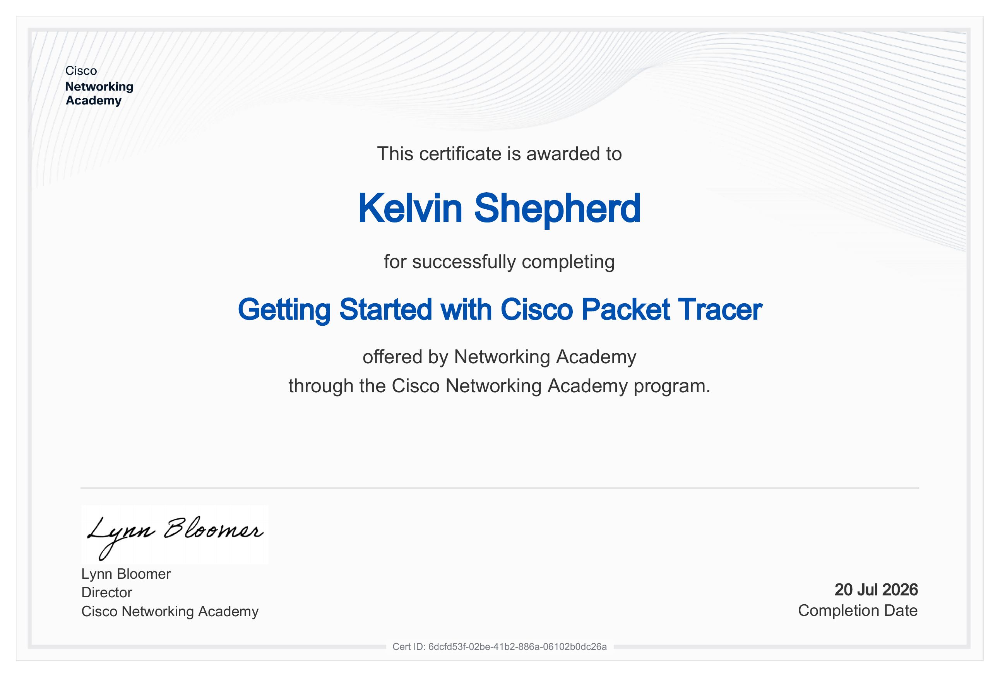

# Expanding Lone Star Logistics — Cisco Packet Tracer Final Exam
Final exam project for **Getting Started with Cisco Packet Tracer** (Cisco Networking Academy). Grade: **A**.
## Overview
This project simulates a network expansion for a fictional logistics company, Lone Star Logistics. The scenario required designing and configuring a multi-site network capable of supporting growth while staying organized, secure, and loop-free.
## What's Configured
- **VLANs** — Segmented traffic by department/function to reduce broadcast domains and improve organization
- **Spanning Tree Protocol (STP)** — Prevented switching loops and enabled redundant links across the switched network
- **Routing** — Configured inter-VLAN and site-to-site connectivity so traffic could reach across the expanded network
## Files
| File | Description |
|---|---|
| `Kelvin_S_Project_Git_Hub.pkz` | Multi-user Packet Tracer project archive (topology, device configs, and simulation) |
## How to Open
This project requires **Cisco Packet Tracer** (free with a Cisco Networking Academy account) — GitHub can't preview `.pkz` files directly.
1. Download [Cisco Packet Tracer](https://www.netacad.com/courses/packet-tracer)
2. Clone or download this repo
3. Open the `.pkz` file in Packet Tracer to explore the topology, device configs, and run the simulation
## Certification
Completed as part of the Cisco Networking Academy "Getting Started with Cisco Packet Tracer" course.

