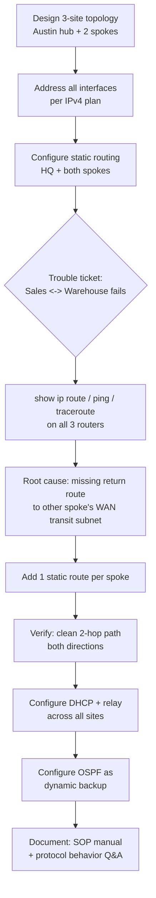

# Lone Star Logistics — 3-Site Network Build (Cisco Packet Tracer)
Final exam project for **Getting Started with Cisco Packet Tracer** (Cisco Networking Academy). Grade: **A**.

## Overview
Designed, built, and troubleshot a 3-site hub-and-spoke network for a simulated logistics company: Austin Headquarters (hub), Round Rock Sales Office, and San Marcos Warehouse (spokes). Covers full interface addressing, static routing between all three sites, a real trouble-ticket diagnosis and fix, DHCP with cross-site relay, and OSPF as a dynamic routing backup — plus a written rebuild-from-scratch SOP and a set of protocol-behavior questions answered directly from Packet Tracer packet captures.

## What's Configured
- **Interface addressing** — every router interface addressed per a defined IPv4 plan (LAN subnets per site, dedicated WAN transit subnets between hub and each spoke)
- **Static routing** — routes on all three routers so each spoke reaches HQ, HQ reaches both spokes, and — the easy-to-miss piece — each spoke reaches the *other* spoke's LAN and WAN transit subnet through HQ
- **Trouble-ticket diagnosis** — methodically diagnosed a real connectivity fault (Sales and Warehouse couldn't reach each other) using `show ip route`, `ping`, and `traceroute`; isolated the root cause to a missing return route on each spoke's WAN transit subnet, then corrected it with two added static routes and verified a clean two-hop path in both directions
- **DHCP** — centralized DHCP server at HQ with `ip helper-address` relay configured on both spoke routers' LAN interfaces, verified across all 8 client PCs
- **OSPF (bonus)** — configured as a fully-converged dynamic routing backup alongside the static routes, with neighbor and link-state database verification on all three routers
- **Protocol behavior analysis** — ARP resolution, the Layer 2 "hop-by-hop" MAC rewriting rule vs. unchanged Layer 3 addressing, TTL decrement per hop, and OSPF Hello/multicast behavior — each answered using an actual PDU capture from Packet Tracer's Simulation mode

## Files
| File | Description |
|---|---|
| `Kelvin_S_Project.pkz` | Multi-user Packet Tracer project archive (topology, device configs, and simulation) |
| `Kelvin_S_Project.docx` | Full write-up: addressing plan, routing config, trouble-ticket diagnosis, DHCP, OSPF, and protocol-behavior Q&A with packet captures |
| `Kelvin_Shepherd_SOP_Manual.docx` | Standard Operating Procedure: rebuild the entire network from an empty canvas, plus a troubleshooting table and Packet Tracer CLI quirks reference |

## How to Open
This project requires **Cisco Packet Tracer** (free with a Cisco Networking Academy account) — GitHub can't preview `.pkz` files directly.
1. Download [Cisco Packet Tracer](https://www.netacad.com/courses/packet-tracer)
2. Clone or download this repo
3. Open the `.pkz` file in Packet Tracer to explore the topology, device configs, and run the simulation
4. Refer to `Kelvin_S_Project.docx` for the full write-up and `Kelvin_Shepherd_SOP_Manual.docx` for the rebuild procedure

## Network & Diagnosis Flow

## Interview Prep: Sample Questions & Answers

### Conceptual
- Why does a hub-and-spoke network need a route from each spoke to the *other* spoke's transit subnet, not just to HQ?
- What's the difference between static and dynamic (OSPF) routing, and why configure both on the same network?
- Why does `show ip route ospf` return nothing even when OSPF is fully converged and working?
- What is `ip helper-address` for, and why do DHCP client broadcasts need it to cross a router hop?
- Explain the "hop-by-hop" addressing rule: what stays the same and what changes at every router?

### Practical
- Walk me through how you'd diagnose two sites on the same network that can reach a shared hub but not each other.
- How would you verify OSPF is actually functioning if the routing table shows no OSPF-learned routes?
- A DHCP client comes back with a `0.0.0.0` gateway — what would you check first?
- How would you confirm a WAN link that shows `down/down` is a cabling issue rather than a config issue?

### Behavioral

**Q: Tell me about a time you diagnosed a network problem systematically rather than guessing.**

- **Situation:** In a trouble-ticket scenario, a junior technician's prior configuration left three symptoms: HQ could reach the Warehouse but not Sales; Sales couldn't reach the Warehouse; and the Warehouse could reach HQ but couldn't send print jobs to Sales.
- **Task:** Find the actual root cause across three routers and fix it without breaking anything that was already working.
- **Action:** I worked methodically instead of guessing — confirmed every interface was correctly addressed and up, then compared each router's routing table against what full reachability required. Ping and traceroute from the spokes showed traffic reaching the hub but failing at the second hop. I ran an extended ping sourced from the hub's own spoke-facing interface to isolate whether the fault was on the outbound or return path, which pointed to the return path specifically.
- **Result:** Root cause was a missing static route on each spoke back to the *other* spoke's WAN transit subnet — traffic sent directly from a router's own WAN interface used that transit subnet as its source, and with no return route, replies were silently dropped. Added one static route per spoke, then verified a clean two-hop path in both directions with ping and traceroute. The bigger takeaway: isolating outbound vs. return path early narrows a multi-symptom problem fast, instead of treating three symptoms as three separate problems.

## Certification
Completed as part of the Cisco Networking Academy "Getting Started with Cisco Packet Tracer" course.

