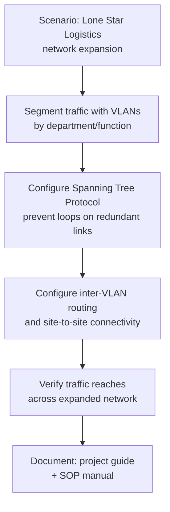

# Expanding Lone Star Logistics — Cisco Packet Tracer Final Exam
Final exam project for **Getting Started with Cisco Packet Tracer** (Cisco Networking Academy). Grade: **A**.
## Overview
This project simulates a network expansion for a fictional logistics company, Lone Star Logistics. The scenario required designing and configuring a multi-site network capable of supporting growth while staying organized, secure, and loop-free.
## What's Configured
- **VLANs** — Segmented traffic by department/function to reduce broadcast domains and improve organization
- **Spanning Tree Protocol (STP)** — Prevented switching loops and enabled redundant links across the switched network
- **Routing** — Configured inter-VLAN and site-to-site connectivity so traffic could reach across the expanded network
## Files
| File | Description |
|---|---|
| `Kelvin_S_Project.pkz` | Multi-user Packet Tracer project archive (topology, device configs, and simulation) |
| `Kelvin_S_Project.docx` | Written project guide/documentation for completing the assignment |
| `Kelvin_Shepherd_SOP_Manual.docx` | Standard Operating Procedure manual for the network configuration |
## How to Open
This project requires **Cisco Packet Tracer** (free with a Cisco Networking Academy account) — GitHub can't preview `.pkz` files directly.
1. Download [Cisco Packet Tracer](https://www.netacad.com/courses/packet-tracer)
2. Clone or download this repo
3. Open the `.pkz` file in Packet Tracer to explore the topology, device configs, and run the simulation
4. Refer to `Kelvin_S_Project.docx` and `Kelvin_Shepherd_SOP_Manual.docx` for the written guide and SOP documentation

## Design Flow

## Interview Prep: Sample Questions & Answers

### Conceptual
- What's the purpose of VLANs, and why segment a network by department instead of leaving everything on one broadcast domain?
- What problem does Spanning Tree Protocol solve, and what happens on a switched network without it?
- What's the difference between routing between VLANs (inter-VLAN routing) and routing between separate physical sites?
- Why would a growing company like Lone Star Logistics need to plan network expansion in advance rather than just adding devices as needed?
- What are the security benefits of VLAN segmentation, beyond just organization?

### Practical
- Walk me through how you'd add a new department's VLAN to an already-running network without disrupting existing traffic.
- If a redundant link caused a broadcast storm, how would STP have prevented that, and how would you confirm it's actually working?
- How would you troubleshoot two VLANs that can't reach each other despite both having correct IP configs?

### Behavioral

**Q: Tell me about a project where you had to design something for a specific business problem, not just make it work.**

- **Situation:** For a Cisco Networking Academy final exam, I was given a scenario simulating a logistics company (Lone Star Logistics) that needed its network expanded to support company growth.
- **Task:** Design and configure a multi-site network that stayed organized, secure, and loop-free as it scaled — not just get devices talking to each other.
- **Action:** I segmented traffic using VLANs by department/function to keep broadcast domains contained and the network organized as it grew. I configured Spanning Tree Protocol to allow redundant links for reliability without risking switching loops. I set up inter-VLAN and site-to-site routing so traffic could move correctly across the expanded topology. I also documented the full build in a written project guide and a separate SOP manual, so the configuration could be understood and maintained by someone else later.
- **Result:** Completed the project with a grade of A. The documentation habit — writing a guide and SOP manual alongside the actual configuration — is something I've carried into other projects, since a network that only the original builder can maintain isn't actually finished.

## Certification
Completed as part of the Cisco Networking Academy "Getting Started with Cisco Packet Tracer" course.

