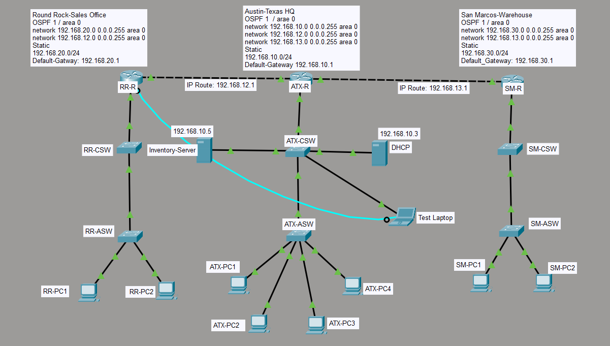

# 01 — Network Topology

**Project:** Lone Star Logistics multi-site network upgrade
**Tool:** Cisco Packet Tracer
**Date:** 2026-07-25

## Goal

Design and configure a three-site hub-and-spoke network for a fictional
logistics company. Each site has its own LAN, and all three must be
mutually reachable.

## The Three Sites

| Site | Role | LAN Subnet | Notes |
|------|------|------------|-------|
| Austin, TX | Headquarters (hub) | 192.168.10.0/24 | Hosts DHCP server and inventory DB |
| Round Rock, TX | Sales office (spoke) | 192.168.20.0/24 | Single-homed to Austin |
| San Marcos, TX | Warehouse (spoke) | 192.168.30.0/24 | Single-homed to Austin |

## WAN Transit Subnets

Austin is the hub. Each spoke connects to Austin over its own point-to-point
/24 transit subnet:

| Link | Subnet | Austin Side | Spoke Side |
|------|--------|-------------|------------|
| Austin ↔ Round Rock | 192.168.12.0/24 | 192.168.12.1 | 192.168.12.2 |
| Austin ↔ San Marcos | 192.168.13.0/24 | 192.168.13.1 | 192.168.13.2 |

## Topology

**Key components:**

- **3 routers** — `ATX-R` (hub), `RR-R` and `SM-R` (spokes)
- **6 switches** — an access switch and a distribution switch at each site
- **2 servers at Austin** — Inventory DB (`192.168.10.5`) and DHCP (`192.168.10.3`)
- **8 end-user PCs** — 4 at Austin, 2 at Round Rock, 2 at San Marcos
- **1 test laptop** — connected via console cable to `ATX-R` for CLI access

## Why Hub-and-Spoke

- **Cost:** No direct spoke-to-spoke link required
- **Manageability:** Single point for routing policy (Austin)
- **Realistic:** Matches how small businesses actually connect branch offices

**The tradeoff:** all spoke-to-spoke traffic traverses the hub. If a spoke
needs to reach another spoke, the route must pass through Austin. This is
central to the troubleshooting scenario documented in
[04-troubleshooting.md](04-troubleshooting.md).

## What I Learned

- Physical topology in Packet Tracer doesn't guarantee reachability — you
  can cable everything correctly and still have a broken network if the
  routing isn't complete.
- The choice between hub-and-spoke and full-mesh is about cost vs.
  redundancy. Hub-and-spoke is common because it's cheaper.
- Documenting the subnets in a table *before* configuring interfaces saves
  time and prevents IP address mistakes.

## Next

→ [02-addressing.md](02-addressing.md) — IP addressing scheme and interface configuration
