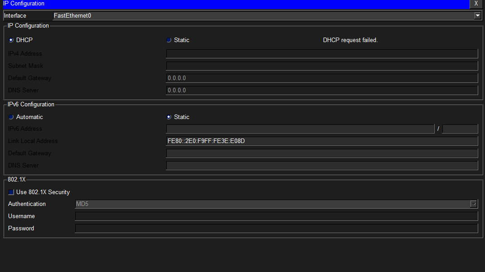
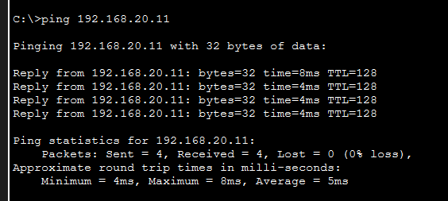
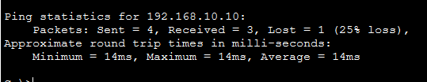
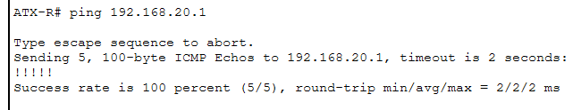

# 04 — Troubleshooting the Broken Spoke-to-Spoke Path

**Objective:** Diagnose and correct three symptoms left by a prior
misconfiguration, without breaking anything that was already working.

This is the most important doc in the repo. It shows not just that the
network was configured, but that it was **diagnosed**.

## The Scenario

A junior technician's weekend work left three symptoms:

1. **HQ could reach the Warehouse but not Sales**
2. **Sales could not reach the Warehouse**
3. **Warehouse could reach HQ but could not send print jobs to Sales**

Read the symptoms carefully. They're not three separate problems — they're
three different angles on the same root cause.

## Diagnostic Method

### Step 1 — Rule out physical and interface problems

show ip interface brief

on all three routers. Every interface came back `up/up` with the correct
address. **Physical layer and addressing were eliminated as causes.**

### Step 2 — Compare routing tables to requirements

show ip route

**What was found:**

- ATX-R (hub): correctly had routes to both branch LANs
- RR-R (Sales): missing a route to `192.168.13.0/24` (Warehouse WAN)
- SM-R (Warehouse): missing a route to `192.168.12.0/24` (Sales WAN)

The LAN routes were all present. What was missing was the routes to the
**other spoke's transit subnet** — the /24 subnet used for the WAN link
between that spoke and Austin.

### Step 3 — Isolate the failure path

ATX-R#ping 192.168.20.1 → Success (HQ reaches Sales LAN)
ATX-R#ping 192.168.30.1 → Success (HQ reaches Warehouse LAN)

RR-R#ping 192.168.30.1 → FAILED (100% loss)

**Trace the failed path:**

RR-R#traceroute 192.168.30.1
1 192.168.12.1 2 msec 2 msec 2 msec ← reached Austin
2 * * * ← never reached San Marcos

The packet reached Austin (hop 1) but not San Marcos (hop 2). **The
problem had to be on the return path.**

### Step 4 — Isolate the return path specifically

Running `ping` from RR-R's shell uses RR-R's LAN interface as the source
IP. But **traffic that transits through RR-R** uses a different source:
the WAN interface address. To simulate that traffic, we use an **extended
ping sourced from a specific interface**:

ATX-R#ping
Protocol [ip]:
Target IP address: 192.168.30.1
Extended commands [n]: y
Source address or interface: 192.168.12.1

**This also failed.** Confirmed: **traffic sourced from the WAN transit
subnet wasn't getting replies back.**

## Root Cause

When a router sends traffic with its own WAN interface as the source, the
source IP is on the **transit subnet** (e.g., `192.168.12.0/24`). The
receiving router needs a route back to that transit subnet to reply.

- **SM-R had no route to `192.168.12.0/24`**
- **RR-R had no route to `192.168.13.0/24`**

So replies from Warehouse to Sales — addressed to the Sales WAN subnet —
were silently dropped at SM-R. And vice versa.

## The Fix

Two static routes — one on each spoke:

! On RR-R:
ip route 192.168.13.0 255.255.255.0 192.168.12.1

! On SM-R:
ip route 192.168.12.0 255.255.255.0 192.168.13.1

RR-R#ping 192.168.30.1
Success rate is 100 percent (5/5), round-trip min/avg/max = 4/4/4 ms

RR-R#traceroute 192.168.30.1
1 192.168.12.1 2 msec 2 msec 2 msec
2 192.168.13.2 4 msec 4 msec ← now reaches San Marcos

SM-R#ping 192.168.20.1
Success rate is 100 percent (5/5)

## Evidence

**Failure (before fix):**

**Cross-branch success (after fix):**

**Router-originated traffic (the fix in action):**

## What I Learned

- **Three symptoms can be one root cause.**
- **Extended ping sourced from a specific interface is the single most
  useful diagnostic for asymmetric routing.**
- **A route to a LAN is not the same as a route to the subnet that LAN's
  router uses for its own outbound traffic.**
- **`traceroute` shows you where the packet dies.** The two-hop failure
  pattern was the clue that the outbound path was fine and the return
  path wasn't.

## Why This Matters

This scenario is a compressed version of a real support ticket. It tests
not just "can you configure a network" but "can you look at symptoms,
form a hypothesis, and test it systematically." That's the difference
between a network builder and a network troubleshooter.

## Next

→ [05-dhcp.md](05-dhcp.md) — DHCP server configuration and relay

