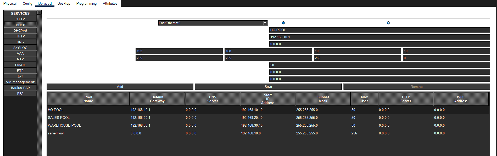
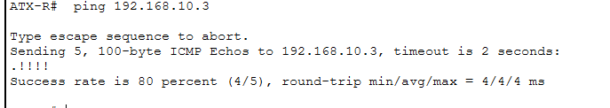

# 05 — DHCP Server Configuration and Relay

**Objective:** Configure a centralized DHCP server at Austin with three
scopes — one per site — and configure `ip helper-address` on each spoke
router so client DHCP broadcasts reach the server across the WAN.

## Why Centralized DHCP

The alternative is a DHCP server at each site. Centralizing at HQ:

- **Reduces administrative overhead** — one server, one console, one backup
- **Ensures consistent addressing** — no risk of a spoke's scope drifting
- **Costs nothing extra** — the HQ server is on the LAN, and relay is one
  CLI line per spoke

## The Server

| Property | Value |
|----------|-------|
| IP address | 192.168.10.3 (static) |
| Subnet mask | 255.255.255.0 |
| Default gateway | 192.168.10.1 (ATX-R) |
| Location | Austin HQ LAN |

**Why static IP:** the DHCP server itself must have a predictable address.
If it got its own address via DHCP, you'd have a chicken-and-egg problem.

## The Scopes

| Pool Name | Default Gateway | Start IP | Subnet Mask | Max Users |
|-----------|-----------------|----------|-------------|----------:|
| HQ-POOL | 192.168.10.1 | 192.168.10.10 | 255.255.255.0 | 50 |
| SALES-POOL | 192.168.20.1 | 192.168.20.10 | 255.255.255.0 | 50 |
| WAREHOUSE-POOL | 192.168.30.1 | 192.168.30.10 | 255.255.255.0 | 50 |

**Note the pattern:** each scope's default gateway is the *local router's
LAN interface for that subnet* — not the DHCP server's own IP. This is
critical: a client in Round Rock needs its default gateway to be
192.168.20.1 (RR-R's LAN interface), not the Austin router.

## DHCP Relay — Why It's Needed

DHCP client broadcasts do **not** cross router boundaries. The initial
DHCP DISCOVER message uses the Layer 2 broadcast MAC `FFFF.FFFF.FFFF`,
which the router drops by default. So a Sales PC in 192.168.20.0/24
cannot reach a DHCP server on 192.168.10.0/24 without help.

`ip helper-address` tells the router: *"If you receive a DHCP broadcast
on this interface, unicast it to this specific address."* The router
acts as a DHCP relay agent — it rewrites the broadcast as a unicast to
the server, preserving the original client's subnet so the server picks
the right scope.

## Configuration

### On RR-R (Sales)

interface GigabitEthernet0/1
ip helper-address 192.168.10.3

### On SM-R (Warehouse)

interface GigabitEthernet0/1
ip helper-address 192.168.10.3

**ATX-R does not need a helper address** on its LAN interface — the DHCP
server is directly connected to that subnet, so broadcasts already reach
it. Adding `ip helper-address` there would be harmless but redundant.

## The `serverPool` Pitfall

Packet Tracer auto-creates a default DHCP pool called `serverPool` with:

- A subnet that **overlaps** HQ-POOL (192.168.10.0/24)
- A **blank** default gateway field (rendered as `0.0.0.0`)

This caused one HQ PC to receive a default gateway of `0.0.0.0` instead
of `192.168.10.1` — because the misconfigured `serverPool` was answering
DHCP requests before the properly-scoped HQ-POOL got a chance.

**Fix:** delete `serverPool`. The single remaining conflict was resolved
and every HQ PC received the correct gateway.

This is documented in the SOP manual under "Common Pitfalls."

## Verification — All 8 PCs

Every PC was switched from Static to DHCP and confirmed to receive the
correct address, mask, and gateway for its own site:

| Site | PC | IP Address | Default Gateway |
|------|----|-----------:|----------------:|
| Sales | RR-PC1 | 192.168.20.10 | 192.168.20.1 |
| Sales | RR-PC2 | 192.168.20.11 | 192.168.20.1 |
| HQ | ATX-PC1 | 192.168.10.10 | 192.168.10.1 |
| HQ | ATX-PC2 | 192.168.10.11 | 192.168.10.1 |
| HQ | ATX-PC3 | 192.168.10.12 | 192.168.10.1 |
| HQ | ATX-PC4 | 192.168.10.13 | 192.168.10.1 |
| Warehouse | SM-PC1 | 192.168.30.10 | 192.168.30.1 |
| Warehouse | SM-PC2 | 192.168.30.11 | 192.168.30.1 |

**Note the pattern:** each PC's gateway is its own site's router LAN
interface. This proves the DHCP relay is working correctly — the server
is delivering the correct scope to each subnet.

**DHCP request from HQ PC:**

## What I Learned

- **DHCP relay is required whenever the client and server are on different
  subnets.** There's no way around it — broadcasts don't cross routers.
- **`ip helper-address` goes on the router interface that faces the
  client**, not the interface that faces the server.
- **The server picks the scope based on the source subnet of the relayed
  request** — that's how it knows which pool to use.
- **A default or leftover DHCP pool can silently break things.** The
  `serverPool` conflict didn't cause an error, it just gave one PC a
  useless gateway.
- The `show ip dhcp binding` command on a real IOS DHCP server lists
  active leases — useful for verifying clients got the expected addresses.

## Next

→ [06-ospf-bonus.md](06-ospf-bonus.md) — OSPF as a backup to static routes
