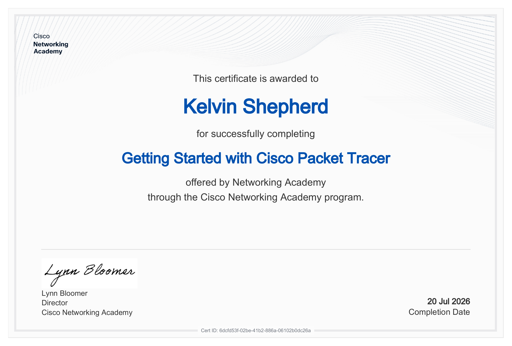

# 08 — Interview Prep

Sample interview questions drawn from this project, with answers.
These are the kinds of questions a networking or security role might
ask about a candidate who has built a multi-site network in Packet
Tracer.

## Conceptual

### Why does a hub-and-spoke network need a route from each spoke to the *other* spoke's transit subnet, not just to HQ?

Because **router-originated traffic uses the source interface's subnet
as its source IP.** When traffic from Sales transits through Sales's
WAN interface, its source IP is on the Sales WAN transit subnet
(192.168.12.0/24). The Warehouse router needs a route back to that
subnet, or it can't reply. A route to the Sales *LAN* is not enough —
the LAN and the transit subnet are different networks.

### What's the difference between static and dynamic (OSPF) routing, and why configure both on the same network?

- **Static routes** are manually configured, deterministic, and use no
  CPU. They're ideal when the topology is small and stable.
- **OSPF** automatically discovers neighbors, calculates routes, and
  recalculates if the topology changes.

Running both is a real production pattern. Static routes often win the
forwarding decision (because AD 1 beats AD 110), which means OSPF runs
as a **backup** that would take over automatically if the static routes
were removed. This is useful during a migration from static to dynamic,
or when you want determinism in normal operation but self-healing if
something breaks.

### Why does `show ip route ospf` return nothing even when OSPF is fully converged and working?

Because **administrative distance decides between routing sources.**
When both a static route (AD 1) and an OSPF-learned route (AD 110)
exist for the same destination, the static route wins and gets
installed in the forwarding table. The OSPF route is computed and
present in the LSDB, but it never makes it into `show ip route`.

To verify OSPF is actually working, use `show ip ospf neighbor` and
`show ip ospf database`.

### What is `ip helper-address` for, and why do DHCP client broadcasts need it to cross a router hop?

DHCP DISCOVER messages use the Ethernet broadcast MAC
`FFFF.FFFF.FFFF`, which routers drop by default. So a client on one
subnet can't reach a DHCP server on a different subnet without help.

`ip helper-address <server-ip>` tells the router: *"If you receive a
DHCP broadcast on this interface, unicast it to that server address."*
The router acts as a relay agent — it forwards the request with the
client's source subnet preserved, so the server picks the right scope.

### Explain the "hop-by-hop" addressing rule: what stays the same and what changes at every router?

- **Layer 3 (IP) source and destination: unchanged.** End-to-end
  addressing identifies the original sender and ultimate destination.
- **Layer 2 (MAC) source and destination: rewritten every hop.** Each
  router discards the incoming Ethernet header and builds a new one
  for the next hop.
- **TTL: decremented by 1 per hop.** When it reaches 0, the packet is
  discarded (and an ICMP Time Exceeded is sent back).

This is why a `traceroute` works — it sends probes with incrementing
TTL values and each router in the path replies when the TTL expires.

## Practical

### Walk me through how you'd diagnose two sites on the same network that can reach a shared hub but not each other.

1. **Rule out interfaces:** `show ip interface brief` on all routers.
   Every relevant interface should be `up/up`.
2. **Compare routing tables:** `show ip route` on each router. Look
   for missing routes to the *other* site's LAN AND the other site's
   WAN transit subnet.
3. **Test from the routers first:** `ping` from each site's router to
   the other site's LAN interface.
4. **If the router-originated ping fails but hub-to-site works,** the
   problem is on the return path. Use an **extended ping sourced from
   the WAN interface** to simulate transit traffic:

ping
Extended commands [n]: y
Source address or interface: <WAN-interface-IP>

5. **Use `traceroute`** to see where the packet dies. If hop 1 responds
but hop 2 times out, the outbound path works but the reply is
being dropped.

### How would you verify OSPF is actually functioning if the routing table shows no OSPF-learned routes?

show ip ospf neighbor
show ip ospf database
show ip ospf database

- `show ip ospf neighbor` — confirms adjacencies reached `FULL`
- `show ip ospf database` — confirms LSAs have been exchanged
- `show ip protocols` — confirms OSPF is enabled and lists the networks
  being advertised

If all three show expected output but the routing table has no `O`
entries, the explanation is almost always **AD — some other routing
source has a lower distance** for the same destinations.

### A DHCP client comes back with a `0.0.0.0` gateway — what would you check first?

1. **The DHCP server's pool configuration** — is the default gateway
   field populated correctly? A blank gateway is sent to clients as
   `0.0.0.0`.
2. **Duplicate or conflicting pools** — Packet Tracer (and real IOS)
   can have multiple pools. If a pool with a lower lease order or
   overlapping subnet is answering first, its config wins.
3. **The scope selection** — DHCP servers pick the pool based on the
   source subnet of the incoming request. If the relay is misconfigured
   or the wrong interface is relaying, the server may answer with the
   wrong pool.

### How would you confirm a WAN link that shows `down/down` is a cabling issue rather than a config issue?

- `down/down` means the physical link is down AND the line protocol is
  down. **Config issues usually produce `up/down`** (physical up, but
  protocol not negotiated — e.g., mismatched encapsulation, missing
  clock rate on a serial link).
- **`down/down` almost always means a physical problem:** bad cable,
  wrong port, or the far end is powered off.
- **Check:** cable, port LED, far-end interface status with
  `show ip interface brief` on the other router.
- **Serial-specific:** a missing `clock rate` on the DCE side will
  keep the link `down/down`.

## Behavioral

### Tell me about a time you diagnosed a network problem systematically rather than guessing.

**Situation:** In a trouble-ticket scenario, a junior technician's
prior configuration left three symptoms — HQ could reach the Warehouse
but not Sales; Sales couldn't reach the Warehouse; and the Warehouse
could reach HQ but couldn't send print jobs to Sales.

**Task:** Find the actual root cause across three routers and fix it
without breaking anything that was already working.

**Action:** I worked methodically instead of guessing:

1. Confirmed every interface was correctly addressed and `up/up`.
2. Compared each router's routing table against what full reachability
   required.
3. Ran ping and traceroute from the spokes — traffic reached the hub
   but failed at the second hop.
4. Ran an **extended ping sourced from the hub's own spoke-facing
   interface** to isolate whether the fault was on the outbound or
   return path. This pointed to the return path specifically.

**Result:** Root cause was a missing static route on each spoke back to
the *other* spoke's WAN transit subnet. Traffic sent directly from a
router's own WAN interface used that transit subnet as its source, and
with no return route, replies were silently dropped.

Added one static route per spoke, then verified a clean two-hop path
in both directions with ping and traceroute.

**The bigger takeaway:** isolating outbound vs. return path early
narrows a multi-symptom problem fast, instead of treating three
symptoms as three separate problems.

## Certification

Completed as part of the **Cisco Networking Academy** "Getting Started
with Cisco Packet Tracer" course.

## Return

← [Back to README](../README.md)
